# Diagrams

The following diagrams utilize mermaid.

## Builder API Architecture

This document provides visual diagrams of the Cake query builder API architecture.

### Builder API Overview

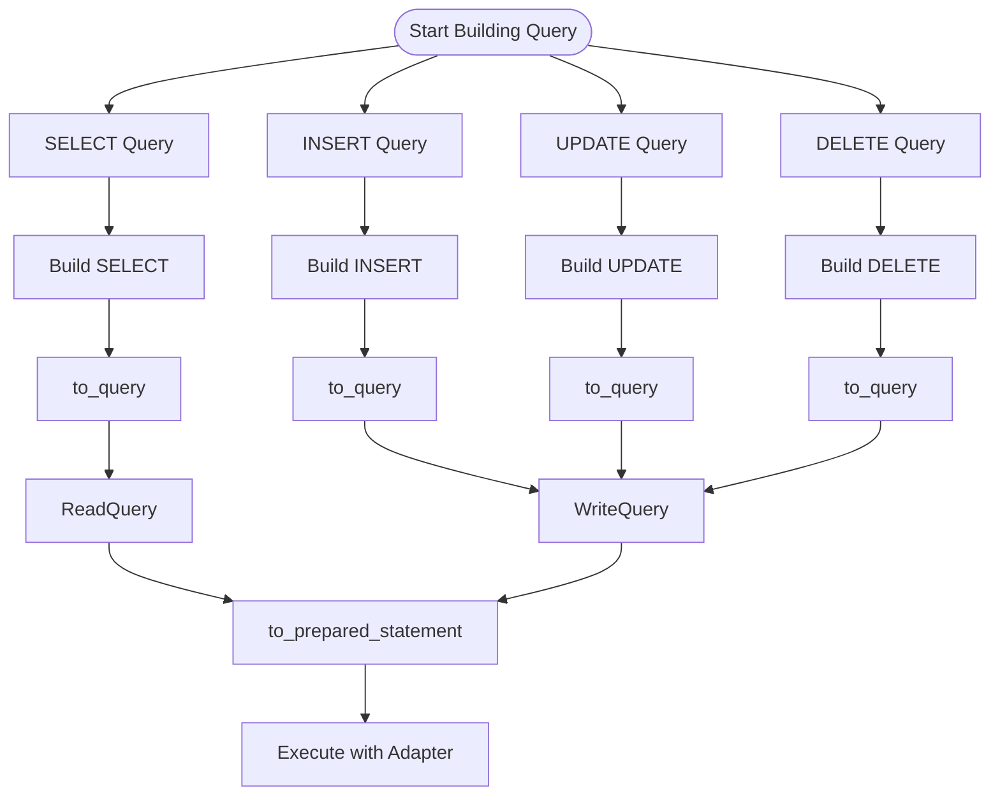

### SELECT Query Builder Flow

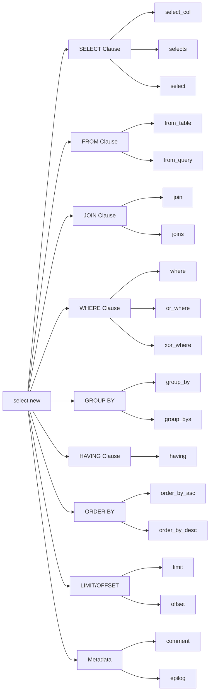

### INSERT Query Builder Flow

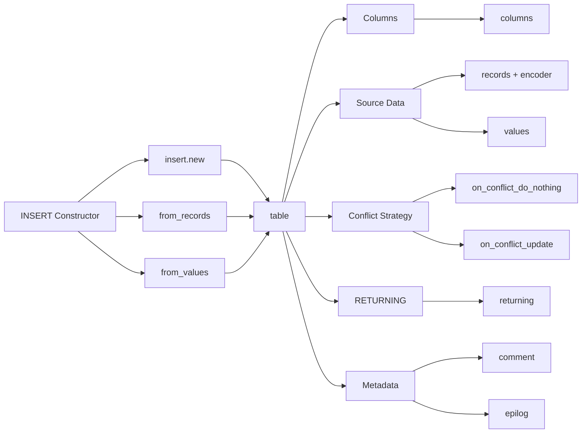

### UPDATE Query Builder Flow

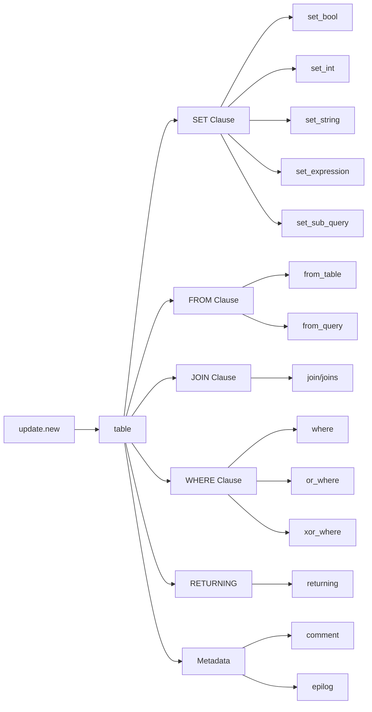

### DELETE Query Builder Flow

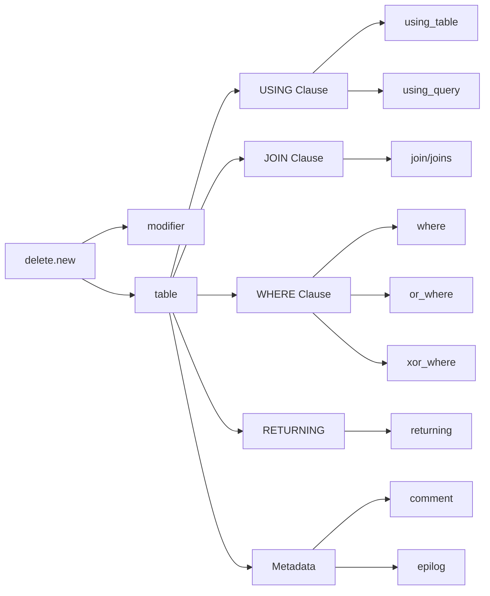

### Query to Prepared Statement Flow

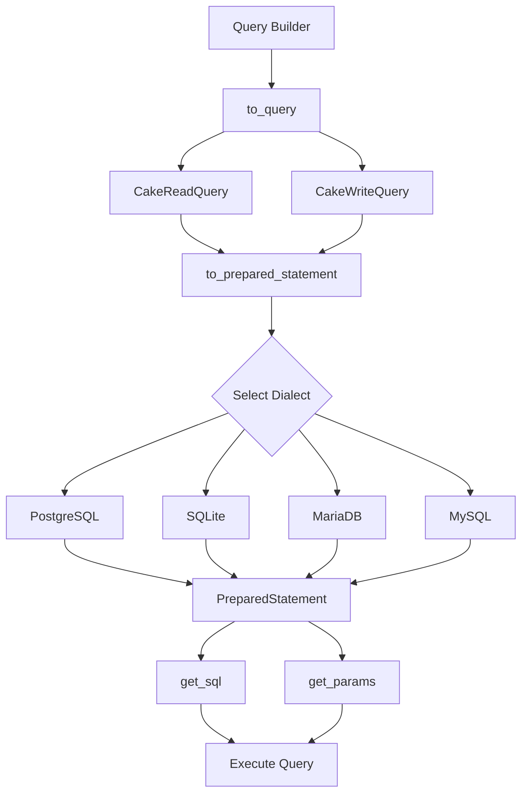

### Value Types and Parameters

```mermaid
graph TB
    Values[Value Types]:::accent0
    
    Values --> Select[SELECT Values]:::accent1
    Select --> Col[col - Column Reference]
    Select --> Alias[alias - Column Alias]
    Select --> Param1[Params: bool, int, float, string, date, null]
    Select --> Frag1[fragment - Raw SQL]
    
    Values --> Insert[INSERT Values]:::accent2
    Insert --> Row[row - InsertRow]
    Insert --> Param2[Params: bool, int, float, string, date, null]
    Insert --> Frag2[fragment - Raw SQL]
    
    Values --> Update[UPDATE Values]:::accent3
    Update --> SetParam[set_* - Param Sets]
    Update --> SetExpr[set_expression - SQL Expression]
    Update --> SetSub[set_sub_query - SubQuery]
    Update --> SetFrag[set_fragment - Raw SQL]
    
    Values --> Where[WHERE Conditions]:::accent4
    Where --> Comparison[eq, ne, gt, lt, gte, lte]
    Where --> Pattern[like, ilike]
    Where --> Membership[in, not_in]
    Where --> Nullness[is_null, is_not_null]
    Where --> Logic[and, or, xor]
```

### JOIN Types and Structure

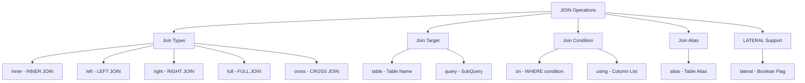

### Complete Query Building Example

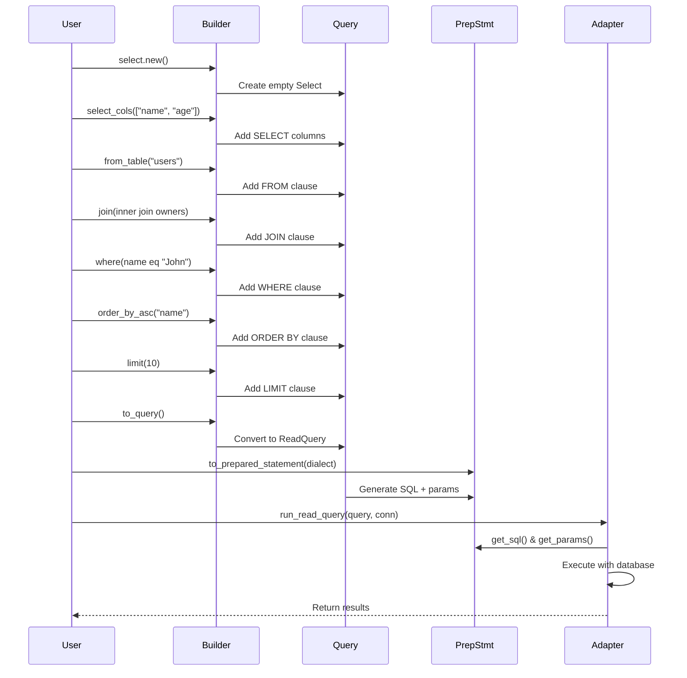

### Builder Pattern Characteristics

```mermaid
graph TB
    Characteristics[Builder Pattern Features]:::accent0
    
    Characteristics --> Immutable[Immutable Updates]:::accent1
    Immutable --> Pipe[Pipeable with |> operator]
    Immutable --> Copy[Each function returns new query]
    
    Characteristics --> TypeSafe[Type Safety]:::accent2
    TypeSafe --> Compile[Compile-time checking]
    TypeSafe --> NoString[No raw SQL strings required]
    
    Characteristics --> Composable[Composable]:::accent3
    Composable --> Conditional[Conditional building]
    Composable --> Reusable[Reusable query fragments]
    
    Characteristics --> Flexible[Flexible Order]:::accent4
    Flexible --> AnyOrder[Call builders in any order]
    Flexible --> Replace[Replace clauses with replace_*]
    
    Characteristics --> Safe[Safe Defaults]:::accent5
    Safe --> NoDefaults[No* variants for empty clauses]
    Safe --> Validation[Runtime validation]
```

### Adapter Integration

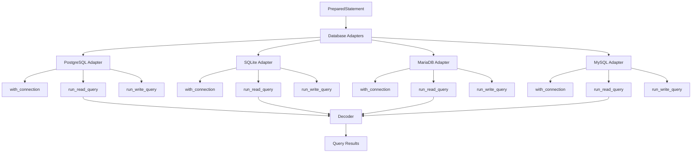

## Type Hierarchy

Type hierarchy of `CakeQuery` and its constructors:

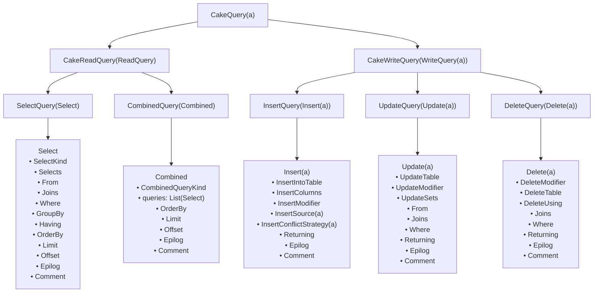

**Legend:**

- `CakeQuery(a)` is the top-level type with type parameter `a`
- **Read Queries** (`CakeReadQuery`) are for SELECT and combined
  operations (UNION, INTERSECT, EXCEPT)
- **Write Queries** (`CakeWriteQuery`) are for INSERT, UPDATE, and DELETE
  operations
- Each query type contains structured fields for building SQL statements
